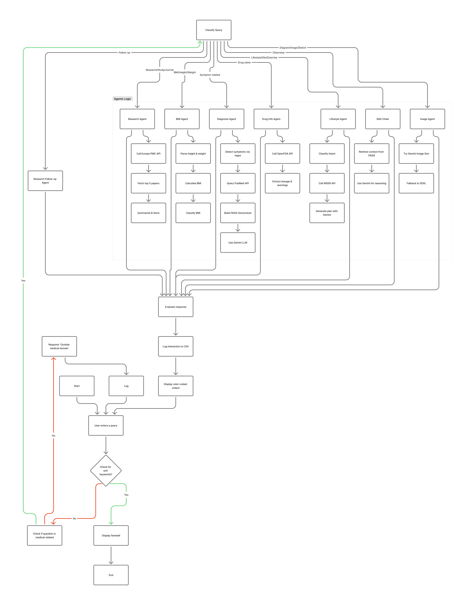

# 🩺 **MEDIBOT — Multi-Agent AI Medical Assistant**

**MEDIBOT** is a next-generation **multi-agent AI system** built for the **medical domain**, designed to act as an intelligent, domain-aware virtual health consultant.  
It combines **Retrieval-Augmented Generation (RAG)** with advanced **Large Language Models (Google Gemini)** and **LangChain orchestration** to ensure reliable, factual, and safe medical communication.  

Unlike generic chatbots, MEDIBOT operates through an **agentic workflow**, where each specialized agent performs a defined clinical or analytical role — such as diagnosis, lifestyle guidance, or drug information retrieval.  
This distributed design ensures **precision**, **transparency**, and **scalability**, making MEDIBOT a highly adaptable platform for both **educational and professional healthcare applications**.  

---

## 🚀 **Project Overview**
MEDIBOT integrates **LangChain**, **LangGraph**, **Gemini**, **FAISS**, and **HuggingFace embeddings** to provide intelligent, medically accurate conversations.  
It uses an agentic workflow — each agent performs a specialized medical task, ensuring precision, safety, and adaptability.

---

### 🧩 **Core Features**
- 💊 **Drug Info Agent** — Fetches FDA-verified drug details  
- ⚖️ **BMI Agent** — Calculates BMI with personalized health guidance  
- 🩺 **Diagnosis Agent** — Identifies possible diseases via PubMed + RAG  
- 🧘 **Lifestyle Agent** — Generates fitness & diet plans (WGER + Gemini)  
- 🧬 **Research Agent** — Retrieves & summarizes latest EuropePMC studies  
- 🖼️ **Image Agent** — Creates educational medical diagrams via Gemini / HF  

---

### 🧠 **Architecture**

**Flow Summary:**  
User Input → Intent Detection → Specialized Agent → LLM (Gemini) → Semantic Evaluation → Output + Logging  

**Detailed Agent Descriptions:**

- **Drug Info Agent**  
  - Fetches accurate, FDA-verified drug details.  
  - Provides dosage, side effects, interactions, and warnings.  
  - Integrates with OpenFDA API for real-time updates.  

- **BMI Agent**  
  - Calculates Body Mass Index based on user-provided height and weight.  
  - Offers personalized health guidance and risk analysis.  

- **Diagnosis Agent**  
  - Identifies potential diseases using symptom input.  
  - Combines PubMed research with RAG methodology for evidence-based suggestions.  
  - Provides ranked possibilities and confidence scores.  

- **Lifestyle Agent**  
  - Generates fitness, nutrition, and wellness plans.  
  - Uses WGER API and Gemini LLM to create personalized guidance.  

- **Research Agent**  
  - Retrieves and summarizes recent studies from EuropePMC.  
  - Provides facts, statistics, and scientific references for informed decisions.  

- **Image Agent**  
  - Generates educational medical diagrams and visual aids.  
  - Utilizes Gemini and HuggingFace models for high-quality visual outputs.  

Each agent interacts independently with external APIs or internal retrievers and sends results through the **Gemini reasoning layer**, ensuring accuracy, factual grounding, and clarity in responses.

---

### ⚙️ **Tech Stack**
**LLM:** Google Gemini  
**Framework:** LangChain, LangGraph  
**Embeddings:** HuggingFace MiniLM  
**Vector DB:** FAISS  
**APIs:** OpenFDA, PubMed, WGER, EuropePMC  
**Visualization:** Matplotlib, Pillow, Rich CLI  

---

### 📊 **Highlights**
- Multi-agent orchestration with memory & semantic evaluation  
- API-driven RAG design for accuracy & transparency  
- Auto-logging and performance tracking (MSE, semantic similarity)  
- Lightweight, extensible, and ready for deployment  

---

### 🧾 **Performance & Metrics**
- ⚡ Avg. Response Time: 1–3 seconds  
- 📊 Semantic Similarity: ≥ 0.85 (typical)  
- 🧠 Memory Trim & Summary: 5-turn rolling window  

---

## 🪪 **License**

This project is licensed under the **[GNU General Public License v3.0](https://www.gnu.org/licenses/gpl-3.0.en.html)**.  
You are free to use, modify, and distribute the software under the terms of this license.  

This project was developed as part of the **AAIDC Module 2 Certification Program**.

---

### 🙌 **Acknowledgements**
- **LangChain / LangGraph** — For providing the orchestration framework that enables smooth multi-agent workflows.  
- **AAIDC Program** — For defining the project requirements, guidance, and structured approach to development.  
- **Google Gemini** — For powering the advanced LLM reasoning and contextual understanding.  
- **Hugging Face** — For embeddings and vector representation support.  
- **OpenFDA API** — For accurate drug information retrieval.  
- **PubMed & EuropePMC** — For evidence-based research and clinical reference data.  
- **WGER API** — For lifestyle, fitness, and diet planning integration.
